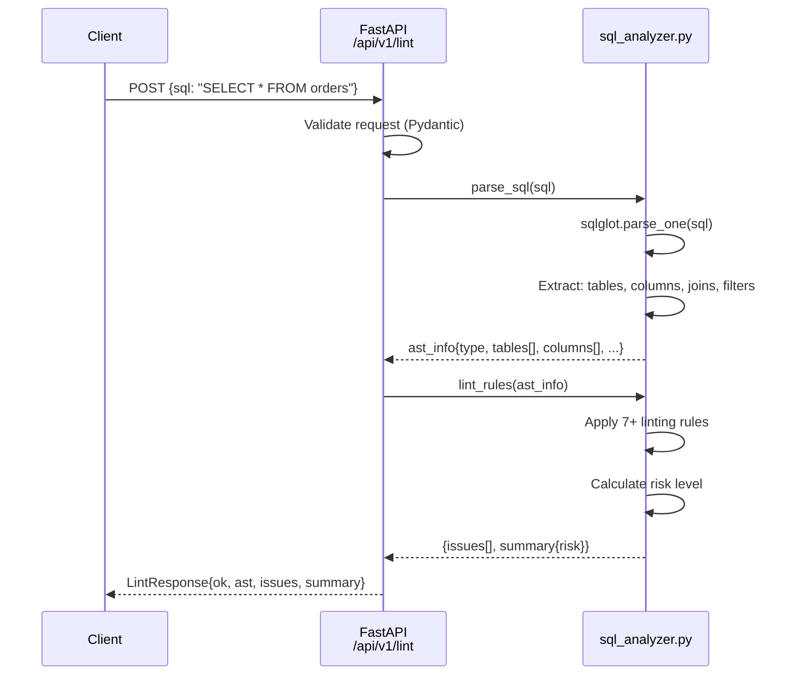
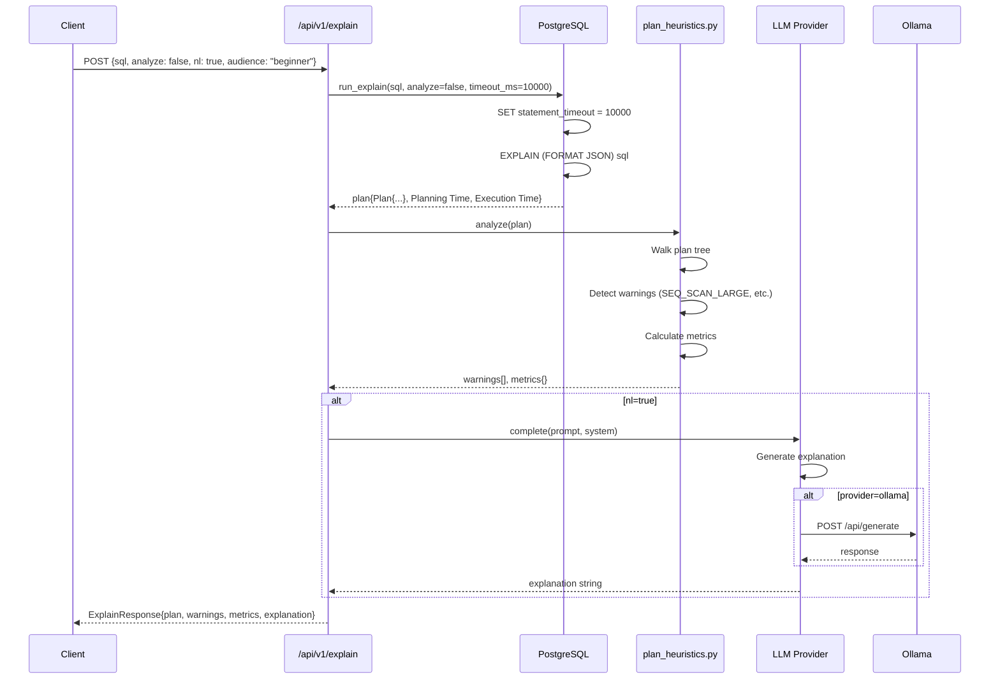
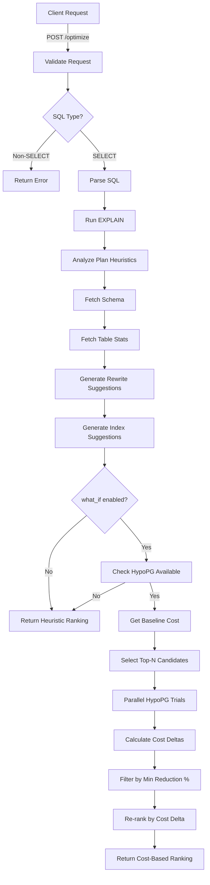

# Part 4: Technical Deep Dive & Reference

**QEO (Query Explanation & Optimization Engine) - v0.7.0**

---

## Quick Navigation

This document provides advanced technical details for developers working on or extending QEO. For:
- **High-level overview**: See Part 1 (Architecture & Stack)
- **API usage**: See Part 2 (Functionality & APIs)
- **Setup and configuration**: See Part 3 (Configuration & Operations)

---

## SECTION 1: Module Deep Dive

### Module: config.py

**File:** `src/app/core/config.py` (104 lines)

**Purpose:** Centralized configuration management using environment variables

**Responsibilities:**
- Load environment variables from `.env` file (via `python-dotenv`)
- Provide type-safe access to all configuration values
- Supply defaults for all settings
- Convert types (string → int, float, bool)

**Public Interface:**

```python
class Settings:
    # Database
    DB_URL: str = os.getenv("DB_URL", "postgresql+psycopg2://...")

    # LLM
    LLM_PROVIDER: str = os.getenv("LLM_PROVIDER", "dummy")
    LLM_MODEL: str = os.getenv("LLM_MODEL", "llama2")
    LLM_TIMEOUT_S: int = int(os.getenv("LLM_TIMEOUT_S", "30"))
    OLLAMA_HOST: str = os.getenv("OLLAMA_HOST", "http://localhost:11434")

    # Optimizer
    OPT_MIN_ROWS_FOR_INDEX: int = int(os.getenv("OPT_MIN_ROWS_FOR_INDEX", "10000"))
    OPT_MAX_INDEX_COLS: int = int(os.getenv("OPT_MAX_INDEX_COLS", "3"))
    OPT_TOP_K: int = int(os.getenv("OPT_TOP_K", "10"))

    # What-if
    WHATIF_ENABLED: bool = os.getenv("WHATIF_ENABLED", "false").lower() == "true"
    WHATIF_MAX_TRIALS: int = int(os.getenv("WHATIF_MAX_TRIALS", "10"))
    WHATIF_MIN_COST_REDUCTION_PCT: float = float(os.getenv("WHATIF_MIN_COST_REDUCTION_PCT", "5"))

    # Helpers
    @property
    def db_url_sqlalchemy(self) -> str:
        """Use for SQLAlchemy engines."""
        return self.DB_URL

    @property
    def db_url_psycopg(self) -> str:
        """Use for raw psycopg2.connect()."""
        return self.DB_URL.replace("postgresql+psycopg2://", "postgresql://")

# Global instance
settings = Settings()
```

**Usage Example:**
```python
from app.core.config import settings

# Access settings
db_url = settings.db_url_psycopg
max_trials = settings.WHATIF_MAX_TRIALS

# Check feature flags
if settings.WHATIF_ENABLED:
    run_whatif_evaluation()
```

**Key Dependencies:**
- `os` - Environment variable access
- `python-dotenv` - `.env` file loading

**Used By:**
- Every module that needs configuration
- Main entry point: `src/app/main.py`
- Database layer: `src/app/core/db.py`

**Design Pattern:** Singleton pattern (single global `settings` instance)

**Error Handling:** Invalid values cause startup failure with clear error messages

**Performance:** Negligible (loaded once at startup)

**Testing:** Mock `os.getenv()` or set env vars before importing

---

### Module: db.py

**File:** `src/app/core/db.py` (445 lines)

**Purpose:** Safe PostgreSQL connection management and query execution

**Responsibilities:**
- Create and manage database connections
- Execute EXPLAIN queries with bounded timeouts
- Fetch schema metadata (tables, columns, indexes, foreign keys)
- Fetch table statistics (row counts, column stats)
- Provide connection pooling
- Handle errors gracefully

**Public Interface:**

```python
@contextmanager
def get_conn() -> pg_connection:
    """Context manager for database connections with auto-cleanup."""
    # Returns psycopg2 connection
    # Automatically closes on context exit

def run_sql(sql: str, params: Tuple = None, timeout_ms: int = 10000) -> List[Tuple]:
    """Execute SQL with timeout and return rows."""

def run_explain(sql: str, analyze: bool = False, timeout_ms: int = 10000) -> Dict:
    """Run EXPLAIN (or EXPLAIN ANALYZE) and return plan JSON."""
    # Returns: {"Plan": {...}, "Planning Time": float, "Execution Time": float}

def run_explain_costs(sql: str, timeout_ms: int = 10000) -> Dict:
    """Run EXPLAIN with costs only (no ANALYZE, no timing)."""

def fetch_schema(schema: str = "public", table: str = None) -> Dict:
    """Fetch schema metadata from information_schema."""
    # Returns: {"schema": str, "tables": [...]}

def fetch_table_stats(tables: List[str], schema: str = "public", timeout_ms: int = 5000) -> Dict[str, Any]:
    """Fetch per-table stats (row counts, indexes)."""
    # Returns: {table_name: {"rows": float, "indexes": [...]}}

def get_table_stats(schema: str, table: str, timeout_ms: int = 5000) -> Dict[str, Any]:
    """Get stats for single table."""

def get_column_stats(schema: str, table: str, timeout_ms: int = 5000) -> Dict[str, Dict]:
    """Get pg_stats for columns (n_distinct, null_frac, avg_width)."""
```

**Example Usage:**

```python
from app.core import db

# Execute EXPLAIN
plan = db.run_explain("SELECT * FROM orders WHERE user_id = 42", analyze=False, timeout_ms=5000)
total_cost = plan["Plan"]["Total Cost"]

# Fetch schema
schema = db.fetch_schema(schema="public", table="orders")
tables = schema["tables"]
for table in tables:
    print(f"Table: {table['name']}, Columns: {len(table['columns'])}")

# Get table stats
stats = db.fetch_table_stats(["orders", "users"])
orders_rows = stats["orders"]["rows"]
```

**Key Design Decisions:**

1. **Connection Pooling:**
   - Simple custom pool (reuse connections)
   - Configurable via `POOL_MINCONN` and `POOL_MAXCONN`
   - Thread-safe (each request gets its own connection)

2. **Timeout Enforcement:**
   - Every query sets `statement_timeout` via `SET LOCAL`
   - Prevents runaway queries
   - Transactions auto-rollback on timeout

3. **Global Connection Option:**
   - `QEO_GLOBAL_CONN=1` reuses single connection (for TEMP tables in tests)
   - Default: separate connections per context

4. **Error Handling:**
   - All functions catch exceptions
   - Rollback on error
   - Close connections on fatal errors

**Key Dependencies:**
- `psycopg2` - PostgreSQL driver
- `src/app/core/config.py` - Database URL

**Used By:**
- `/explain` endpoint: `run_explain()`
- `/optimize` endpoint: `run_explain()`, `fetch_schema()`, `fetch_table_stats()`
- What-if evaluator: `run_explain_costs()`

**Performance:**
- Connection acquisition: 1-5ms (pooled) or 10-50ms (new)
- EXPLAIN: 10-100ms (no ANALYZE) or varies (with ANALYZE)
- Schema fetch: 50-200ms (depends on table count)
- Stats fetch: 10-50ms (cached by PostgreSQL)

**Testing:**
- Mock `psycopg2.connect()` to avoid real DB
- Or use test database with known schema

---

### Module: sql_analyzer.py

**File:** `src/app/core/sql_analyzer.py` (348 lines)

**Purpose:** SQL parsing and static analysis using sqlglot

**Responsibilities:**
- Parse SQL into Abstract Syntax Tree (AST)
- Extract: tables, columns, joins, filters, order_by, group_by, limit
- Run linting rules (7+ checks)
- Calculate risk level (low/medium/high)

**Public Interface:**

```python
def parse_sql(sql: str) -> Dict[str, Any]:
    """Parse SQL and extract structured metadata."""
    # Returns:
    {
        "type": "SELECT" | "INSERT" | "UPDATE" | "DELETE" | "UNKNOWN",
        "sql": str,
        "tables": [{"name": str, "alias": str | None, "raw": str}],
        "columns": [{"table": str | None, "name": str, "raw": str}],
        "joins": [{"type": str, "right": str, "condition": str, "raw": str}],
        "filters": [str],  # WHERE clause predicates
        "group_by": [str],
        "order_by": [str],
        "limit": int | None
    }

def lint_rules(ast_info: Dict[str, Any]) -> Dict[str, Any]:
    """Apply linting rules and return issues."""
    # Returns:
    {
        "issues": [
            {
                "code": str,
                "message": str,
                "severity": "info" | "warn" | "high",
                "hint": str
            }
        ],
        "summary": {"risk": "low" | "medium" | "high"}
    }
```

**Linting Rules Implemented:**

| Rule | Code | Severity | Detection |
|------|------|----------|-----------|
| SELECT * | `SELECT_STAR` | warn | `any(c.get("name") == "*" for c in columns)` |
| Missing JOIN ON | `MISSING_JOIN_ON` | high | `not join.get("condition")` |
| Cartesian Join | `CARTESIAN_JOIN` | high | CROSS JOIN or missing conditions |
| Ambiguous Column | `AMBIGUOUS_COLUMN` | warn | Unqualified column in multi-table query |
| Unfiltered Large Table | `UNFILTERED_LARGE_TABLE` | warn | Table matches pattern + no WHERE/LIMIT |
| Implicit Cast | `IMPLICIT_CAST_PREDICATE` | info | ID column compared with string literal |
| Unused Join | `UNUSED_JOINED_TABLE` | warn | Table joined but never referenced |

**Example Usage:**

```python
from app.core.sql_analyzer import parse_sql, lint_rules

sql = "SELECT * FROM orders o JOIN users u WHERE o.user_id = 42"

# Parse
ast_info = parse_sql(sql)
print(f"Tables: {ast_info['tables']}")  # [{"name": "orders", "alias": "o"}, {"name": "users", "alias": "u"}]
print(f"Filters: {ast_info['filters']}")  # ["o.user_id = 42"]

# Lint
result = lint_rules(ast_info)
print(f"Risk: {result['summary']['risk']}")
for issue in result["issues"]:
    print(f"{issue['severity']}: {issue['message']}")
```

**Key Dependencies:**
- `sqlglot` - SQL parser
- `re` - Regular expressions for pattern matching

**Used By:**
- `/lint` endpoint
- `/optimize` endpoint (for AST extraction)
- Workload analyzer (for pattern detection)

**Performance:**
- Parsing: 5-20ms (depends on query complexity)
- Linting: 1-5ms (pure computation)
- Total: <30ms for typical queries

**Limitations:**
- **Dialect support:** Uses "duckdb" dialect for output (broad compatibility)
- **Complex queries:** Very complex CTEs or subqueries may not parse perfectly
- **Non-standard SQL:** PostgreSQL-specific syntax may not parse (e.g., `LATERAL`)

**Error Handling:**
- Parse errors return `{"type": "UNKNOWN", "error": "..."}`
- Linting continues even with parse errors (reports `PARSE_ERROR` issue)

**Testing:**
- Unit tests with various SQL patterns
- Regression tests for edge cases (nested subqueries, CTEs, etc.)

---

### Module: optimizer.py

**File:** `src/app/core/optimizer.py` (451 lines)

**Purpose:** Deterministic query optimization suggestions

**Responsibilities:**
- Generate rewrite suggestions (5+ patterns)
- Generate index suggestions (deterministic algorithm)
- Score and rank suggestions
- Ensure stable, reproducible outputs

**Public Interface:**

```python
@dataclass(frozen=True)
class Suggestion:
    kind: str  # "rewrite" | "index"
    title: str
    rationale: str
    impact: str  # "low" | "medium" | "high"
    confidence: float  # 0.0 to 1.0
    statements: List[str]  # SQL to execute
    alt_sql: Optional[str] = None  # Alternative query
    safety_notes: Optional[str] = None
    score: Optional[float] = None
    reason: Optional[str] = None
    estReductionPct: Optional[float] = None
    estIndexWidthBytes: Optional[int] = None

def suggest_rewrites(ast_info: Dict, schema: Dict) -> List[Suggestion]:
    """Generate rewrite suggestions."""

def suggest_indexes(ast_info: Dict, schema: Dict, stats: Dict, options: Dict) -> List[Suggestion]:
    """Generate index suggestions using deterministic algorithm."""

def analyze(sql: str, ast_info: Dict, plan: Dict, schema: Dict, stats: Dict, options: Dict) -> Dict:
    """Main entry point: generates all suggestions."""
    # Returns:
    {
        "suggestions": [Suggestion-dict, ...],
        "summary": {"summary": str, "score": float}
    }
```

**Index Advisor Algorithm (Detailed):**

```python
def suggest_indexes(ast_info, schema, stats, options):
    suggestions = []

    # 1. Extract predicates
    eq_keys, range_keys = _extract_eq_and_range_filters(ast_info["filters"])
    join_pairs = _extract_join_keys(ast_info["joins"])
    order_by, group_by = _extract_order_group(ast_info)

    # 2. For each table
    for table_name in ast_info["tables"]:
        # Skip small tables
        if table_stats[table_name]["rows"] < min_rows:
            continue

        # Collect relevant columns
        eq_cols = [c for c in eq_keys if c belongs to table]
        range_cols = [c for c in range_keys if c belongs to table]
        join_cols = [c for c in join_pairs if c belongs to table]
        order_cols = [c for c in order_by if c belongs to table]
        group_cols = [c for c in group_by if c belongs to table]

        # 3. Order columns (CRITICAL)
        ordered_cols = []
        ordered_cols.extend(eq_cols)  # Equality first
        ordered_cols.extend(range_cols)  # Range second
        ordered_cols.extend(order_cols + group_cols)  # Order/group last
        ordered_cols = deduplicate_preserve_order(ordered_cols)
        ordered_cols = ordered_cols[:max_index_cols]  # Cap at max

        # 4. Skip if existing index covers
        if _existing_index_covers(existing_indexes[table], ordered_cols):
            continue

        # 5. Calculate score
        col_stats = get_column_stats(table)
        est_width = sum(col_stats[c]["avg_width"] for c in ordered_cols)

        base_score = 0.0
        base_score += 1.0 * len([c for c in eq_cols if c in ordered_cols])
        base_score += 0.5 * len([c for c in range_cols if c in ordered_cols])
        base_score += 0.25 * len([c for c in order_cols + group_cols if c in ordered_cols])

        # Join boost
        if any(c in join_cols for c in ordered_cols):
            base_score *= JOIN_COL_PRIOR_BOOST  # 1.2x

        # Width penalty
        width_penalty = max(0.1, (INDEX_MAX_WIDTH_BYTES / max(est_width, 1)) ** 0.5)
        score = base_score * width_penalty

        # 6. Estimate improvement %
        est_pct = min(100.0, len(eq_cols) * 10.0 + (5.0 if order_cols else 0.0))

        # 7. Filter
        if est_pct < SUPPRESS_LOW_GAIN_PCT:
            continue
        if est_width > INDEX_MAX_WIDTH_BYTES:
            continue

        # 8. Generate suggestion
        ix_name = f"idx_{table}_" + "_".join(ordered_cols)
        stmt = f"CREATE INDEX CONCURRENTLY {ix_name} ON {table} ({', '.join(ordered_cols)})"

        suggestions.append(Suggestion(
            kind="index",
            title=f"Index on {table}({', '.join(ordered_cols)})",
            rationale="Supports equality, range, and ordering...",
            impact="high" if (eq_cols and order_cols) else "medium",
            confidence=0.7 if order_cols else 0.6,
            statements=[stmt],
            score=round(score, 3),
            reason=f"Boosts equality({len(eq_cols)}), range({len(range_cols)}), order/group({len(order_cols)+len(group_cols)})",
            estReductionPct=round(est_pct, 3),
            estIndexWidthBytes=est_width
        ))

    return suggestions
```

**Why This Algorithm Works:**

1. **Column ordering (Equality → Range → Order):**
   - **Equality first:** Narrows down to specific rows (highest selectivity)
   - **Range second:** Further filters within equality subset
   - **Order last:** PostgreSQL can use index for sorting (avoids Sort node)
   - **Proven optimal** for B-tree indexes

2. **Scoring with width penalties:**
   - Higher score for more selective predicates
   - Join columns get 20% boost (benefit multiple queries)
   - Wide indexes penalized (expensive to maintain)

3. **Filtering:**
   - Skip small tables (sequential scan is faster)
   - Skip if existing index covers
   - Skip low-gain suggestions

4. **Determinism:**
   - Stable column ordering
   - Alphabetical sorting for tie-breaking
   - Float rounding to 3 decimals

**Key Dependencies:**
- `src/app/core/config.py` - Thresholds and limits
- `src/app/core/db.py` - Column stats

**Used By:**
- `/optimize` endpoint
- Workload analyzer

**Performance:**
- Per query: 5-20ms (pure computation, no I/O)
- Scales linearly with table count and predicate complexity

**Testing:**
- Unit tests with synthetic AST
- Integration tests with real database
- Determinism tests (same input → same output)

---

### Module: whatif.py

**File:** `src/app/core/whatif.py` (193 lines)

**Purpose:** Cost-based index evaluation using HypoPG

**Responsibilities:**
- Check HypoPG availability
- Create hypothetical indexes
- Measure cost deltas
- Rank suggestions by cost reduction
- Handle parallelism and timeouts

**Public Interface:**

```python
def evaluate(sql: str, suggestions: List[Dict], timeout_ms: int, force_enabled: bool = None) -> Dict:
    """Evaluate index suggestions using HypoPG."""
    # Returns:
    {
        "ranking": "cost_based" | "heuristic",
        "whatIf": {
            "enabled": bool,
            "available": bool,
            "trials": int,
            "filteredByPct": int
        },
        "suggestions": [enriched_suggestions_with_costs]
    }
```

**Internal Functions:**

```python
def _parse_index_stmt(stmt: str) -> Tuple[str, List[str]]:
    """Extract table and columns from CREATE INDEX statement."""
    # "CREATE INDEX CONCURRENTLY idx_orders_user_id ON orders (user_id, created_at)"
    # Returns: ("orders", ["user_id", "created_at"])

def _plan_total_cost(plan: Dict) -> float:
    """Extract total cost from EXPLAIN JSON."""
    return plan["Plan"]["Total Cost"]

def _hypopg_available() -> bool:
    """Check if HypoPG extension is installed."""
    rows = db.run_sql("SELECT extname FROM pg_extension WHERE extname='hypopg'")
    return any(r[0] == 'hypopg' for r in rows)
```

**Evaluation Algorithm:**

```python
def evaluate(sql, suggestions, timeout_ms):
    # Step 1: Check availability
    if not settings.WHATIF_ENABLED or not _hypopg_available():
        return soft_fail_response()

    # Step 2: Get baseline cost
    baseline_plan = db.run_explain_costs(sql, timeout_ms)
    base_cost = _plan_total_cost(baseline_plan)

    # Step 3: Select top-N candidates
    candidates = [s for s in suggestions if s["kind"] == "index"]
    candidates.sort(key=lambda s: -s.get("score", 0.0))
    candidates = candidates[:WHATIF_MAX_TRIALS]

    # Step 4: Run trials in parallel
    results = {}
    with ThreadPoolExecutor(max_workers=WHATIF_PARALLELISM) as executor:
        futures = {executor.submit(_trial, c): c for c in candidates}

        for future in as_completed(futures):
            # Check global timeout
            if elapsed_time > WHATIF_GLOBAL_TIMEOUT_MS:
                break

            title, cost_after, trial_ms = future.result()
            delta = base_cost - cost_after
            results[title] = {"after": cost_after, "delta": delta}

            # Early stop if best improvement is below threshold
            if best_delta_pct < WHATIF_EARLY_STOP_PCT:
                break

    # Step 5: Attach deltas to suggestions
    for suggestion in suggestions:
        if suggestion["title"] in results:
            r = results[suggestion["title"]]
            suggestion["estCostBefore"] = round(base_cost, 3)
            suggestion["estCostAfter"] = round(r["after"], 3)
            suggestion["estCostDelta"] = round(r["delta"], 3)

    # Step 6: Filter by min reduction %
    filtered = []
    for s in suggestions:
        if s.get("estCostDelta", 0) > 0:
            pct = (s["estCostDelta"] / base_cost) * 100
            if pct >= WHATIF_MIN_COST_REDUCTION_PCT:
                filtered.append(s)
        else:
            filtered.append(s)  # Keep non-index suggestions

    # Step 7: Re-rank by cost delta
    filtered.sort(key=lambda x: (
        -x.get("estCostDelta", 0),
        -impact_rank[x.get("impact")],
        -x.get("confidence", 0),
        x.get("title", "")
    ))

    return {
        "ranking": "cost_based",
        "whatIf": {...},
        "suggestions": filtered
    }

def _trial(candidate):
    """Run single HypoPG trial (executed in parallel)."""
    table, cols = _parse_index_stmt(candidate["statements"][0])

    with db.get_conn() as conn:
        conn.execute("SELECT hypopg_reset()")
        conn.execute(f"SELECT hypopg_create_index('CREATE INDEX ON {table} ({', '.join(cols)})')")

        plan = db.run_explain_costs(sql, timeout_ms)
        cost_after = _plan_total_cost(plan)

        conn.execute("SELECT hypopg_reset()")

        return (candidate["title"], cost_after, elapsed_ms)
```

**Key Features:**

1. **Parallel execution:**
   - Uses `ThreadPoolExecutor` with configurable workers
   - Each trial gets its own DB connection
   - Reduces total evaluation time

2. **Soft-fail design:**
   - Returns heuristic ranking if HypoPG unavailable
   - Doesn't break if individual trials fail
   - Graceful degradation

3. **Optimizations:**
   - Early stop if no good candidates
   - Global timeout to prevent hanging
   - Per-trial timeout for slow queries

4. **Accurate cost measurement:**
   - Uses PostgreSQL's own planner
   - Same cost model as production
   - Considers statistics and indexes

**Key Dependencies:**
- `src/app/core/db.py` - Database access
- `src/app/core/config.py` - What-if settings
- `src/app/core/metrics.py` - Trial duration tracking

**Used By:**
- `/optimize` endpoint (when `what_if=true`)

**Performance:**
- Baseline: 20-50ms
- Per trial: 10-50ms
- 8 trials with 2 workers: 40-200ms total
- Total overhead: +100-500ms vs. heuristic-only

**Testing:**
- Integration tests with real PostgreSQL + HypoPG
- Gated by `RUN_DB_TESTS=1`
- Auto-skip if HypoPG not available

---

## SECTION 2: Complete Workflow Documentation

### Workflow 1: /lint Request (No Database)



**Detailed Steps:**

1. **Client sends request**
   - Method: POST
   - Endpoint: `/api/v1/lint`
   - Body: `{"sql": "SELECT * FROM orders"}`
   - Validation: Pydantic checks `sql` is non-empty string

2. **Parse SQL (sqlglot)**
   - `sqlglot.parse_one(sql)` creates AST
   - Extract tables: `[{"name": "orders", "alias": None}]`
   - Extract columns: `[{"name": "*"}]`
   - Extract filters: `[]` (none)
   - Execution time: 5-20ms

3. **Apply linting rules**
   - **Rule 1: SELECT_STAR** → Match! (found `*` in columns)
   - **Rule 2: CARTESIAN_JOIN** → No match (no joins)
   - **Rule 3: MISSING_JOIN_ON** → No match
   - **Rule 4: AMBIGUOUS_COLUMN** → No match (single table)
   - **Rule 5: UNFILTERED_LARGE_TABLE** → Check table name patterns
     - "orders" matches large table patterns?
     - Has WHERE clause? No
     - Has LIMIT? No
     - → **Match!** Add warning
   - **Rule 6: IMPLICIT_CAST** → No match
   - **Rule 7: UNUSED_JOIN** → No match

4. **Calculate risk**
   - High severity issues: 0
   - Warn severity issues: 2 (SELECT_STAR, UNFILTERED_LARGE_TABLE)
   - Info severity issues: 0
   - Risk level: **medium** (warn_count > 1)

5. **Return response**
   ```json
   {
     "ok": true,
     "ast": {...},
     "issues": [
       {"code": "SELECT_STAR", "severity": "warn", ...},
       {"code": "UNFILTERED_LARGE_TABLE", "severity": "warn", ...}
     ],
     "summary": {"risk": "medium"}
   }
   ```

**Total latency:** 10-30ms (no database I/O)

---

### Workflow 2: /explain Request (With Natural Language)



**Detailed Steps:**

1. **Request received**
   - Client sends: `{"sql": "SELECT * FROM orders WHERE user_id = 42", "analyze": false, "nl": true, "audience": "beginner"}`
   - Validation: Check SQL non-empty, audience valid, timeout within range

2. **Run EXPLAIN**
   - `src/app/core/db.py:100` - `run_explain()`
   - Acquire database connection from pool (1-5ms)
   - Set transaction timeout: `SET LOCAL statement_timeout = 10000`
   - Execute: `EXPLAIN (FORMAT JSON) SELECT * FROM orders WHERE user_id = 42`
   - PostgreSQL generates plan (10-100ms)
   - Parse JSON result
   - Commit and return plan

3. **Analyze plan (heuristics)**
   - `src/app/core/plan_heuristics.py:39` - `analyze(plan)`
   - Walk plan tree: Flatten all nodes
   - For each node:
     * Check `Node Type == "Seq Scan"` → If `Plan Rows > 100,000` → **SEQ_SCAN_LARGE warning**
     * Check `Node Type == "Nested Loop"` with `Plans[1] == "Seq Scan"` → **NESTED_LOOP_SEQ_INNER warning**
     * Check `Sort Method` contains "Disk" → **SORT_SPILL warning**
     * Compare `Actual Rows` vs. `Plan Rows` → If >50% error → **ESTIMATE_MISMATCH warning**
   - Calculate metrics: `planning_time_ms`, `execution_time_ms`, `node_count`
   - Execution time: 1-5ms

4. **Generate natural language explanation (optional)**
   - `src/app/core/llm_adapter.py` - Get LLM provider
   - `src/app/core/prompts.py` - Build prompt:
     ```
     You are a PostgreSQL query performance expert.
     Explain this execution plan to a beginner audience in concise style.

     SQL: SELECT * FROM orders WHERE user_id = 42
     Plan: {...}
     Warnings: [SEQ_SCAN_LARGE]
     Metrics: {planning_time_ms: 0.5, ...}
     ```
   - **If provider == "dummy":**
     * Return deterministic response: "This query performs a sequential scan on the orders table..."
     * Execution time: <1ms
   - **If provider == "ollama":**
     * HTTP POST to `http://localhost:11434/api/generate`
     * Request: `{"model": "llama2", "prompt": "...", "stream": false}`
     * Wait for response (500ms - 5s depending on model size)
     * Parse JSON response
   - **Error handling:**
     * If LLM times out or fails: `explanation: null`, continue with plan/warnings
     * Don't fail entire endpoint

5. **Return response**
   ```json
   {
     "ok": true,
     "plan": {...},
     "warnings": [{"code": "SEQ_SCAN_LARGE", "detail": "..."}],
     "metrics": {"planning_time_ms": 0.5, "execution_time_ms": 0, "node_count": 3},
     "explanation": "This query looks through all 50,000 rows in the orders table to find rows where user_id equals 42. This is slow because there's no index on user_id. PostgreSQL has to read every row from disk and check the condition.",
     "explain_provider": "ollama"
   }
   ```

**Total latency:**
- Without NL: 20-150ms
- With NL (dummy): 20-150ms
- With NL (Ollama 7B): 500ms - 2s
- With NL (Ollama 13B): 2s - 5s

---

### Workflow 3: /optimize Request (Full Pipeline with HypoPG)



**Detailed Flow:**

**Phase 1: Request Validation & Parsing (20-30ms)**
1. Client sends: `{"sql": "SELECT * FROM orders WHERE user_id = 42 ORDER BY created_at DESC LIMIT 100", "what_if": true}`
2. Pydantic validates: `sql` is string, `what_if` is bool, `timeout_ms` in range
3. Parse SQL: `sqlglot.parse_one(sql)`
4. Extract AST: tables=[orders], filters=[user_id=42], order_by=[created_at DESC], limit=100
5. Check query type: SELECT ✓ (proceed)

**Phase 2: EXPLAIN & Heuristics (50-150ms)**
6. Run EXPLAIN: `db.run_explain(sql, analyze=False, timeout_ms=10000)`
7. PostgreSQL returns plan:
   ```json
   {
     "Plan": {
       "Node Type": "Limit",
       "Total Cost": 1910.68,
       "Plans": [
         {
           "Node Type": "Sort",
           "Sort Key": ["created_at DESC"],
           "Plans": [
             {
               "Node Type": "Seq Scan",
               "Relation Name": "orders",
               "Filter": "(user_id = 42)",
               "Plan Rows": 50000
             }
           ]
         }
       ]
     }
   }
   ```
8. Analyze plan: Detect `SEQ_SCAN_LARGE` warning (50,000 rows)

**Phase 3: Schema & Stats (50-100ms)**
9. Fetch schema: `db.fetch_schema()` → tables, columns, existing indexes
10. Fetch stats: `db.fetch_table_stats(["orders"])` → rows=2,500,000
11. Get column stats: `db.get_column_stats("public", "orders")` → avg_width for each column

**Phase 4: Generate Suggestions (5-20ms)**
12. **Rewrite advisor:**
    - Detect SELECT * → Suggest explicit columns
    - Detect ORDER BY + LIMIT → Suggest Top-N optimization
    - Detect IN subquery → Suggest EXISTS

13. **Index advisor:**
    - Extract predicates:
      * Equality: `user_id = 42`
      * Range: none
      * Order: `created_at DESC`
    - Order columns: `[user_id, created_at]` (equality → range → order)
    - Check existing indexes: No index on (user_id, created_at)
    - Calculate score:
      * Base: 1.0 (eq) + 0.0 (range) + 0.25 (order) = 1.25
      * Width: 4 (int) + 8 (timestamp) = 12 bytes
      * Width penalty: (8192 / 12)^0.5 = 26.2 (no penalty)
      * Final score: 1.25
    - Estimate improvement: 1 eq col * 10% + 5% (order) = 15%
    - Generate: `CREATE INDEX CONCURRENTLY idx_orders_user_id_created_at ON orders (user_id, created_at)`

14. Merge suggestions: 2 rewrites + 1 index = 3 total
15. Sort alphabetically for determinism

**Phase 5: HypoPG What-If Evaluation (100-300ms)**
16. Check HypoPG available: Query `pg_extension` → HypoPG installed ✓
17. Get baseline cost: `db.run_explain_costs(sql)` → Total Cost: 1910.68
18. Select candidates: Top 8 index suggestions (only 1 in this case)
19. **Trial 1: idx_orders_user_id_created_at**
    - Create hypothetical index: `SELECT hypopg_create_index('CREATE INDEX ON orders (user_id, created_at)')`
    - Re-run EXPLAIN: `db.run_explain_costs(sql)` → Total Cost: 104.59
    - Calculate delta: 1910.68 - 104.59 = 1806.09
    - Calculate reduction %: (1806.09 / 1910.68) * 100 = 94.5%
    - Cleanup: `SELECT hypopg_reset()`
    - Trial duration: 23ms
20. Attach costs to suggestion:
    - `estCostBefore`: 1910.680
    - `estCostAfter`: 104.590
    - `estCostDelta`: 1806.090
    - `trialMs`: 23.456
21. Filter by min reduction %: 94.5% > 5% ✓ (keep)
22. Re-rank by cost delta: idx_orders_user_id_created_at is #1

**Phase 6: Response Assembly (1-5ms)**
23. Build response:
    ```json
    {
      "ok": true,
      "suggestions": [
        {
          "kind": "index",
          "title": "Index on orders(user_id, created_at)",
          "estCostBefore": 1910.680,
          "estCostAfter": 104.590,
          "estCostDelta": 1806.090,
          "statements": ["CREATE INDEX CONCURRENTLY ..."]
        },
        {"kind": "rewrite", "title": "Replace SELECT * ...", ...},
        {"kind": "rewrite", "title": "Align ORDER BY ...", ...}
      ],
      "ranking": "cost_based",
      "whatIf": {"enabled": true, "available": true, "trials": 1, "filteredByPct": 0}
    }
    ```
24. Return to client

**Total latency:** 200-600ms (with what-if)

---

## SECTION 3: Performance Characteristics

### Latency Breakdown by Component

| Component | Typical Latency | What Affects It |
|-----------|-----------------|----------------|
| **SQL Parsing** | 5-20ms | Query complexity, sqlglot performance |
| **Linting** | 1-5ms | Number of rules, query structure |
| **EXPLAIN (no ANALYZE)** | 10-100ms | Query complexity, planner overhead |
| **EXPLAIN (with ANALYZE)** | Varies | **Actual query execution time** + planning overhead |
| **Schema Fetch** | 50-200ms | Number of tables, cache hit/miss |
| **Table Stats Fetch** | 10-50ms | Number of tables, PostgreSQL stats cache |
| **Rewrite Advisor** | 2-10ms | Number of patterns checked |
| **Index Advisor** | 5-20ms | Number of tables, predicate complexity |
| **HypoPG Baseline** | 20-50ms | Same as EXPLAIN |
| **HypoPG Trial** | 10-50ms | Query complexity |
| **HypoPG 8 Trials (2 workers)** | 40-200ms | Parallel speedup, individual trial times |
| **LLM (dummy)** | <1ms | Deterministic response |
| **LLM (Ollama 7B)** | 500ms-2s | Model size, prompt length, CPU/GPU |
| **LLM (Ollama 13B)** | 2s-5s | Model size, prompt length, CPU/GPU |

### Total Response Times

| Endpoint | Configuration | Typical Latency | Range |
|----------|---------------|-----------------|-------|
| `/health` | - | <1ms | <1ms |
| `/healthz` | - | 5-50ms | 5-100ms |
| `/lint` | - | 10-30ms | 5-100ms |
| `/explain` | No NL | 50-200ms | 20-500ms |
| `/explain` | With NL (dummy) | 50-200ms | 20-500ms |
| `/explain` | With NL (Ollama) | 1-5s | 500ms-10s |
| `/optimize` | Heuristic only | 100-300ms | 50-1000ms |
| `/optimize` | With HypoPG (8 trials) | 200-800ms | 100-2000ms |
| `/workload` | 10 queries, no what-if | 500ms-2s | 300ms-5s |
| `/workload` | 50 queries, with what-if | 5-20s | 2s-60s |

### Scalability Limits

**Query Complexity:**
- Simple queries (1-2 tables): Fast (50-200ms)
- Medium queries (3-5 tables, multiple joins): Moderate (200-500ms)
- Complex queries (10+ tables, subqueries, CTEs): Slow (500ms-2s)

**Table Count:**
- 1-10 tables: No impact
- 10-100 tables: Schema fetch +100-500ms
- 100+ tables: Schema fetch +500ms-2s (consider caching)

**Index Candidates:**
- 1-5 candidates: Fast what-if (40-100ms)
- 5-10 candidates: Moderate what-if (100-300ms)
- 10-20 candidates: Slow what-if (300ms-1s)

**Concurrent Requests:**
- Up to `POOL_MAXCONN` concurrent requests without queuing
- Beyond pool limit: Requests wait for connections (adds latency)
- Recommended: `POOL_MAXCONN = workers * 2` to `workers * 5`

### Memory Usage

| Component | Memory per Request | Total (4 workers) |
|-----------|-------------------|-------------------|
| **Python Runtime** | Baseline | ~100 MB |
| **FastAPI App** | ~10 MB | ~50 MB |
| **Database Connection** | ~2-5 MB | 8-40 MB (pool) |
| **Plan JSON** | ~10-100 KB | Transient |
| **Schema Cache** | ~1-10 MB | Shared |
| **Total** | - | **~200-400 MB** |

**Memory scaling:**
- Scales with: Number of workers, pool size, schema size
- Does NOT scale with: Number of requests (per-request memory freed after response)

### Bottlenecks

**Identified bottlenecks:**
1. **HypoPG trials** - Largest contributor to latency (100-300ms)
   - Mitigation: Reduce `WHATIF_MAX_TRIALS`, increase `WHATIF_PARALLELISM`
2. **Schema fetching** - Expensive for large databases (200ms+)
   - Mitigation: Enable caching (`CACHE_SCHEMA_TTL_S=300`)
3. **LLM explanations** - Very slow (500ms-5s)
   - Mitigation: Use `dummy` provider, or async processing
4. **EXPLAIN ANALYZE** - Actually runs query (can be very slow)
   - Mitigation: Use EXPLAIN without ANALYZE (costs only)

---

## SECTION 4: Limitations & Future Work

### Current Limitations

**1. Query Type Support**
- **Limitation:** Only SELECT statements are optimized
- **Impact:** INSERT/UPDATE/DELETE queries are rejected
- **Rationale:** Optimization strategies differ significantly
- **Workaround:** Use `/lint` for basic validation
- **Future:** Support UPDATE/DELETE optimization in v2.0

**2. PostgreSQL-Only**
- **Limitation:** Only works with PostgreSQL databases
- **Impact:** Can't analyze MySQL, SQL Server, Oracle queries
- **Rationale:** Tight integration with PostgreSQL EXPLAIN and HypoPG
- **Future:** MySQL adapter using EXPLAIN ANALYZE (v1.5)

**3. Single-Query Optimization**
- **Limitation:** `/optimize` analyzes one query at a time
- **Impact:** Can't detect cross-query patterns (e.g., N+1 queries)
- **Workaround:** Use `/workload` for multi-query analysis
- **Future:** Better N+1 detection and batching suggestions

**4. No Multi-Column Statistics**
- **Limitation:** Index advisor uses single-column stats only
- **Impact:** May suggest indexes that don't help correlated columns
- **Rationale:** PostgreSQL `pg_stats` lacks multi-column histograms (unless extended statistics created)
- **Future:** Detect and use extended statistics when available

**5. No Index Size Estimation**
- **Limitation:** Estimates index width but not total size
- **Impact:** Can't warn "this index will be 10 GB"
- **Rationale:** Requires detailed cardinality analysis
- **Future:** Estimate index size based on row count and avg_width

**6. Limited Rewrite Patterns**
- **Limitation:** Only 5 rewrite suggestions implemented
- **Impact:** Misses optimization opportunities (e.g., CTE optimization, window function rewrites)
- **Future:** Add 10+ more rewrite patterns

**7. No Cost Model Tuning**
- **Limitation:** Uses PostgreSQL's default cost parameters
- **Impact:** Cost estimates may not match production workload
- **Rationale:** Tuning cost model requires deep expertise
- **Future:** Allow custom cost parameters (`random_page_cost`, etc.)

**8. No Partial Index Support**
- **Limitation:** Can't suggest partial indexes (WHERE clause in index)
- **Impact:** Misses optimization for filtered queries
- **Example:** `CREATE INDEX ... WHERE status = 'active'`
- **Future:** Detect common filters and suggest partial indexes

---

### Known Issues

**1. sqlglot Dialect Limitations**
- **Issue:** Complex PostgreSQL-specific syntax may not parse
- **Examples:** `LATERAL` joins, custom operators, full-text search
- **Workaround:** Use simpler queries or test manually

**2. HypoPG Hypothetical Index Limitations**
- **Issue:** HypoPG estimates may differ from real index performance
- **Reason:** Doesn't account for: index bloat, cache effects, concurrent load
- **Impact:** Estimates are directionally correct but not exact

**3. Float Rounding Edge Cases**
- **Issue:** Very small or very large costs may lose precision
- **Example:** `0.0001234` becomes `0.000` (3 decimal places)
- **Impact:** Minimal (only affects display)

**4. Connection Pool Exhaustion**
- **Issue:** High concurrency can exhaust connection pool
- **Symptom:** Requests wait for connections (increased latency)
- **Fix:** Increase `POOL_MAXCONN` or use connection pooler (PgBouncer)

---

### Future Improvements

**Planned Enhancements (Roadmap):**

**v1.1 (Performance)**
- Async HypoPG trials (non-blocking what-if evaluation)
- Redis-based schema caching (multi-instance support)
- Query result caching for identical queries
- Streaming JSON responses for large workloads

**v1.2 (Features)**
- Partial index suggestions
- Multi-column index statistics support
- BRIN and GIN/GiST index suggestions
- Covering index recommendations (INCLUDE columns)
- Query rewrite confidence scoring with ML

**v1.3 (Integrations)**
- Slack/Discord notifications for slow queries
- Grafana dashboard templates
- GitHub Actions integration (CI/CD query linting)
- VS Code extension

**v1.4 (Database Support)**
- MySQL adapter (EXPLAIN ANALYZE parsing)
- SQLite support (basic optimization)
- Snowflake/BigQuery cloud warehouse support (read-only analysis)

**v1.5 (Advanced Analysis)**
- Query plan visualization (interactive tree)
- Index usage tracking (which indexes are actually used)
- Query regression detection (compare plans over time)
- Cost model tuning recommendations

**v2.0 (AI-Powered)**
- Fine-tuned LLM for query optimization
- Learned index suggestions (ML model trained on production workloads)
- Automatic query rewriting with validation
- Workload-aware optimization (analyze application logs)

---

### Technical Debt

**Identified debt:**
1. **Connection pooling:** Custom implementation should be replaced with PgBouncer or pgpool
2. **Error handling:** Some exceptions caught too broadly (`except Exception`)
3. **Type hints:** Not all functions have complete type annotations
4. **Test coverage:** Integration test coverage ~70% (target: 90%)
5. **Documentation:** Some internal functions lack docstrings

**Prioritization:**
- **High:** Connection pooling (affects production stability)
- **Medium:** Error handling (affects debugging)
- **Low:** Type hints, documentation (quality of life)

---

## SECTION 5: Comparison with Alternatives

### QEO vs. Competitors

| Feature | QEO | pgAdmin EXPLAIN | pg_stat_statements | AWS RDS Performance Insights | Commercial Tools (SolarWinds, Quest) |
|---------|-----|-----------------|---------------------|------------------------------|-------------------------------------|
| **Cost** | Free (OSS) | Free | Free | Included with RDS | $1k-10k+/year |
| **Privacy** | Local | Local | Local | Cloud (AWS only) | Cloud or On-Prem |
| **What-If Analysis** | ✅ HypoPG | ❌ No | ❌ No | ❌ No | ✅ Yes (some) |
| **Index Suggestions** | ✅ Automatic | ❌ Manual | ⚠️ Missing Index Hints | ⚠️ Basic | ✅ Advanced |
| **Query Rewriting** | ✅ 5+ patterns | ❌ No | ❌ No | ❌ No | ✅ Yes |
| **Cost-Based Ranking** | ✅ Yes | ❌ No | ❌ No | ⚠️ Limited | ✅ Yes |
| **Natural Language** | ✅ Optional (Ollama) | ❌ No | ❌ No | ❌ No | ⚠️ Some |
| **Workload Analysis** | ✅ Multi-query | ❌ Single query | ✅ Aggregate stats | ✅ Query insights | ✅ Yes |
| **Database Support** | PostgreSQL | PostgreSQL | PostgreSQL | PostgreSQL, MySQL (AWS RDS) | Multi-DB |
| **Offline Capable** | ✅ Yes | ✅ Yes | ✅ Yes | ❌ No | ⚠️ Depends |
| **CI/CD Integration** | ✅ CLI | ❌ No | ❌ No | ❌ No | ⚠️ Some |
| **Setup Complexity** | Low (Docker) | Low | Low (extension) | None (managed) | Medium-High |

**When to use QEO:**
- You need **cost-based** index recommendations
- You want **privacy** (data doesn't leave your network)
- You need **CI/CD** integration for query linting
- You want **what-if** analysis without creating real indexes
- You're using **PostgreSQL** with **HypoPG**

**When NOT to use QEO:**
- You need **MySQL/SQL Server/Oracle** support (use commercial tools)
- You want **managed service** with zero setup (use cloud tools)
- You need **real-time monitoring** (use pg_stat_statements + Grafana)
- You want **AI-powered** rewrites with validation (wait for QEO v2.0)

---

## SECTION 6: Glossary

**AST (Abstract Syntax Tree):**
A tree representation of SQL structure created by parsing. Allows programmatic analysis of query components (tables, columns, joins, etc.).

**B-tree Index:**
Default index type in PostgreSQL. Balanced tree structure that supports equality, range, and order queries efficiently.

**Cost:**
PostgreSQL's internal metric for query expense. Lower cost = faster query. Units are arbitrary but consistent for comparisons.

**EXPLAIN:**
PostgreSQL command that shows query execution plan without running the query. `EXPLAIN ANALYZE` actually executes and shows real metrics.

**EXPLAIN ANALYZE:**
Like EXPLAIN but actually runs the query and shows actual vs. estimated rows, execution time, buffer usage.

**Execution Plan:**
PostgreSQL's strategy for executing a query: which indexes to use, join order, scan methods, etc.

**Heuristic:**
A rule of thumb that usually works but isn't guaranteed optimal. QEO's index advisor uses heuristics (equality → range → order).

**HypoPG:**
PostgreSQL extension that creates "hypothetical" indexes in memory. Allows testing index performance without disk I/O or schema changes.

**Index:**
Database structure that speeds up queries by organizing data for fast lookups. Like a book index.

**LLM (Large Language Model):**
AI model that generates human-like text. QEO uses LLMs (like Llama 2) for natural language explanations.

**Ollama:**
Local LLM runtime. Allows running models like Llama 2 on your own machine (no cloud, no API keys).

**Predicate:**
A condition in a WHERE clause (e.g., `user_id = 42`). Used to filter rows.

**Prometheus:**
Monitoring system that scrapes metrics from services. QEO exposes metrics for tracking performance.

**psycopg2:**
PostgreSQL database adapter for Python. Used for all database operations in QEO.

**Pydantic:**
Data validation library using Python type hints. Used for API request/response validation.

**Sequential Scan (Seq Scan):**
Reading every row in a table from disk. Slow for large tables. Avoided by using indexes.

**sqlglot:**
SQL parser library for Python. Converts SQL strings into Abstract Syntax Trees (AST).

**What-if Analysis:**
Testing the impact of changes (like adding an index) without actually making the change. QEO uses HypoPG for this.

**Cost-Based Optimization:**
Using actual cost estimates (from the database planner) to rank suggestions. More accurate than heuristics.

---

## SECTION 7: FAQ

**Q: Is QEO safe to use on production databases?**

A: **Yes**, with caveats:
- QEO never modifies your data or schema (read-only operations)
- EXPLAIN queries are safe (don't execute the actual query unless `analyze=true`)
- **Do NOT use `analyze=true` on write queries** (INSERT/UPDATE/DELETE) as this will execute them
- HypoPG creates hypothetical indexes only (no disk writes)
- Recommendation: Test on staging first, monitor resource usage

---

**Q: Why is my query slow?**

Common causes:
1. **Missing indexes:** Run `/optimize` to get index suggestions
2. **Sequential scans:** Look for "Seq Scan" nodes in EXPLAIN output
3. **Inefficient joins:** Nested loops without indexes
4. **Poor statistics:** Run `ANALYZE table_name` to update stats
5. **Bloated indexes:** Run `REINDEX` if indexes haven't been rebuilt recently
6. **Wrong query plan:** Check if `EXPLAIN ANALYZE` matches estimates

---

**Q: How do I interpret optimization suggestions?**

Look at:
1. **`estCostDelta`:** How much cost is saved (higher = better)
2. **`estReductionPct`:** Percentage improvement (94.5% = 16x faster)
3. **`impact`:** "high" = significant improvement expected
4. **`confidence`:** How sure we are (0.9 = very confident, 0.5 = less sure)
5. **`statements`:** The exact SQL to run (use `CONCURRENTLY` to avoid blocking)

**Apply suggestions:**
1. Copy the `CREATE INDEX CONCURRENTLY` statement
2. Run it on staging first
3. Measure actual impact with `EXPLAIN ANALYZE`
4. If good, apply to production

---

**Q: Can I use QEO with cloud databases?**

**Yes**, as long as:
- Your database is **PostgreSQL**
- You have **HypoPG extension installed** (for what-if analysis)
- You can connect from where QEO is running

**Cloud compatibility:**
- **AWS RDS PostgreSQL:** ✅ Yes (HypoPG available via extensions)
- **Azure Database for PostgreSQL:** ✅ Yes (HypoPG available)
- **Google Cloud SQL PostgreSQL:** ✅ Yes (HypoPG available)
- **Heroku Postgres:** ⚠️ Limited (HypoPG not available on all plans)
- **Supabase:** ✅ Yes (HypoPG available)

---

**Q: Why are LLM explanations slow?**

LLM inference is computationally expensive:
- **7B parameter models:** 500ms-2s per explanation
- **13B parameter models:** 2s-5s per explanation
- **Depends on:** CPU/GPU, model size, prompt length

**Speedup options:**
1. Use **smaller models** (llama2:7b instead of llama2:13b)
2. Use **GPU acceleration** (if available)
3. Use **dummy provider** for testing (instant)
4. Run Ollama on **separate machine** (offload compute)

---

**Q: How accurate are cost estimates?**

**Very accurate for relative comparisons:**
- HypoPG uses PostgreSQL's own cost model
- Same planner that would run your query in production
- Accounts for statistics, indexes, table sizes

**BUT:**
- Costs are **relative**, not absolute (1000 cost units ≠ 1 second)
- Doesn't account for: cache effects, concurrent load, disk I/O variance
- **Best use:** Comparing options (index A vs. index B), not predicting exact runtime

**Validation:** Always test suggestions with `EXPLAIN ANALYZE` on real workload.

---

**Q: What if HypoPG is not available?**

QEO **gracefully degrades:**
- Falls back to **heuristic-only** ranking
- Still provides index suggestions (based on query patterns)
- `whatIf.available: false` in response
- Suggestions are still useful, just not cost-ranked

**Install HypoPG:**
```sql
-- PostgreSQL 16
CREATE EXTENSION hypopg;

-- Or via package manager
apt-get install postgresql-16-hypopg
```

---

**Q: Can I run QEO without Docker?**

**Yes:**
1. Install Python 3.11+
2. Install PostgreSQL 16 locally
3. Install HypoPG extension
4. Clone repository: `git clone ...`
5. Install dependencies: `pip install -e .`
6. Set environment: `export DB_URL=...`
7. Run API: `PYTHONPATH=src uvicorn app.main:app --reload`

**Or use CLI only:**
```bash
pip install .
qeo optimize --sql "SELECT * FROM orders WHERE user_id = 42"
```

---

**Q: How do I contribute to QEO?**

See `CONTRIBUTING.md` for guidelines:
1. Fork repository
2. Create feature branch
3. Write tests (unit + integration)
4. Ensure tests pass: `pytest -q`
5. Format code: `black .`
6. Submit pull request

**Good first issues:**
- Add new linting rules
- Add new rewrite patterns
- Improve documentation
- Add test coverage

---

## Conclusion

This technical reference provides deep insights into QEO's architecture, workflows, and implementation details. For practical usage:
- **Getting started:** See Part 3 (Setup Guide)
- **API usage:** See Part 2 (API Reference)
- **Architecture overview:** See Part 1 (Architecture & Stack)

**Questions or issues?** File an issue at https://github.com/yourusername/queryexpnopt/issues
